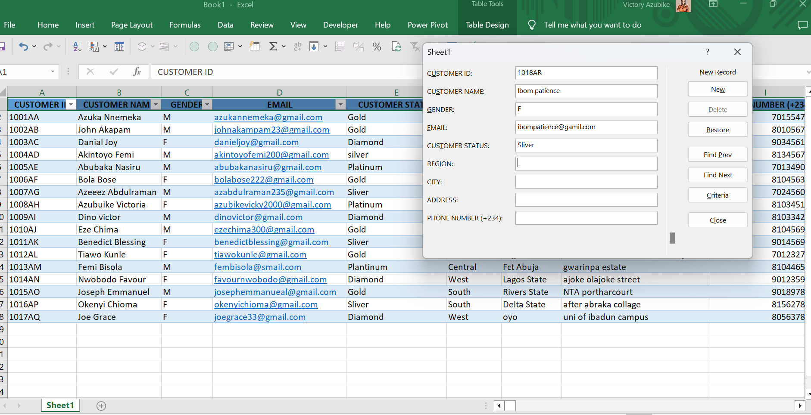
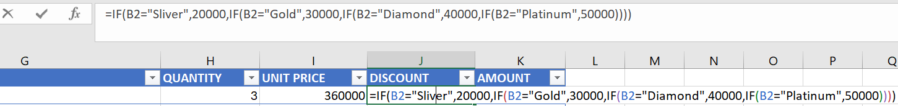
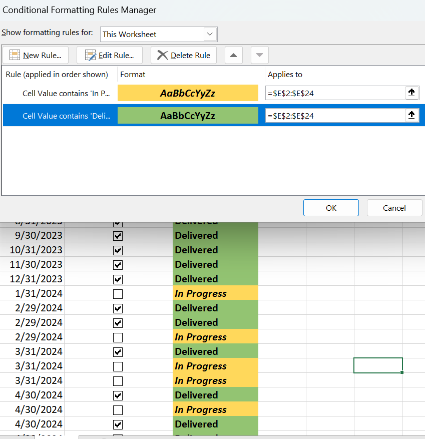
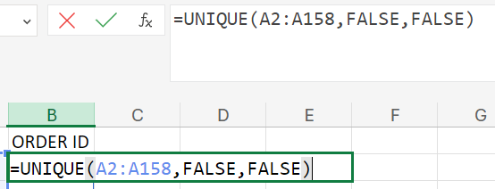
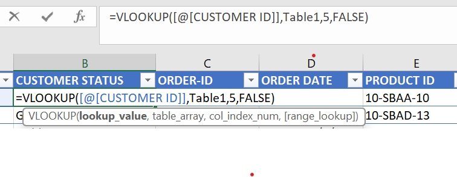

# Data-entry-with-Excel-linked-with-Access
## Franky's Tech Hub dataset

## Introduction
---

This Projects contains steps taken to enter Franky's dataset in Excel and how this data is preserved and linked to another Database (Access), while showcasing the relationship of the data through Data Modelliing

**_Disclaimer_** -> _This data set does not represent any company data set. this data was personally hand typed and it is all fabricated for the purpose of learning._

### Tools and skills Demonstrated

#### Tools
- Excel
- Access

#### Skills Demonstrated
- Data entry with Forms
- Nested ifs Funtion
- Distint funtion
- Vlookup
- Index and Match
- Condition Formating
- Sum Funtion
- Linked Database
- Data modelling

Data entry with form               |                    Nested ifs funtion         
:---------------------------------:|:-------------------------------------:
      |  
---

 Condition Formating                         |                    Distint funtion
:-------------------------------------------:|:-------------------------------------:
  |  
 ---

Vlookup                            |                    Index and Match          
:---------------------------------:|:-------------------------------------:
     | 
 ---
### Connected Database

