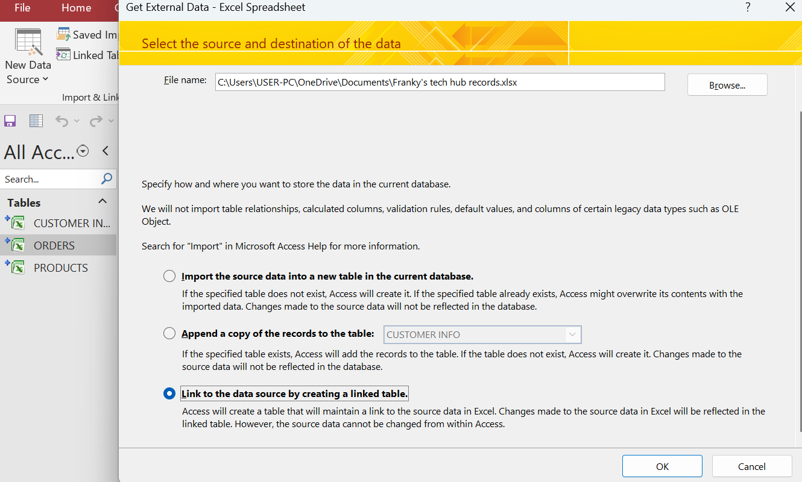

# Data-entry-with-Excel-linked-with-Access
## Franky's Tech Hub dataset

## Introduction
---

This Projects contains steps taken to enter Franky's dataset in Excel and how this data is preserved and linked to another Database (Access), while showcasing the relationship of the data through Data Modelliing

**_Disclaimer_** -> _This data set does not represent any company data set. this data was personally hand typed and it is all fabricated for the purpose of learning._

### Tools and skills Demonstrated

#### Tools
- Excel
- Access

#### Skills Demonstrated
- Data entry with Forms
- Nested ifs Funtion
- Distint funtion
- Vlookup
- Index and Match
- Condition Formating
- Sum Funtion
- Linked Database
- Data modelling

Data entry with form               |                    Condition Formating 
:---------------------------------:|:---------------------------------------:
      |  
---

  Nested ifs funtion               |                    Distint funtion
:---------------------------------:|:-------------------------------------:
  |  
 ---

 Index and Match                    |                             Vlookup         
:----------------------------------:|:-------------------------------------:
  |       
 ---
### Connected Database

The connected Database by a file "Franky's Tech Hub" allow for easy process of result, prevent duplication of data and new information is reflected in the connected Database system

to react with the data click here
- [Excel](Franky's_tech_hub_records.xlsx)
- [Access](Franky's_tech_hub.accdb)

### Data Modelling
the model used to create relationship of the data is **Relation Data Model**. this model delineate the one to many relationship and was fashioned in Access Database System

### Conculsion

Due to complex funtionality Access comes in handy in keeping the file organized, maintaining Data integrity while being avaliable to multiple simutaneous users. it enable business and enterprise user to manage data ana analyse vast amount of information efficiently

